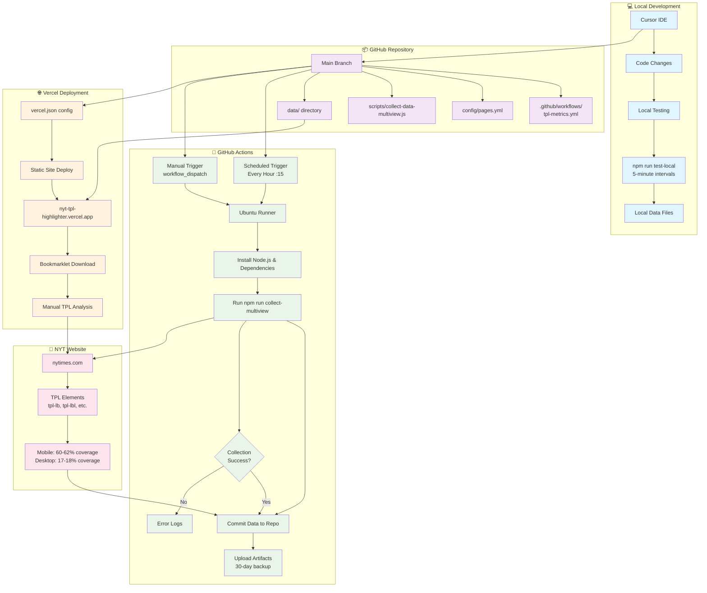

# TPL Metrics Collection Workflow

## 🔄 Complete Development & Deployment Flow



## 📋 Detailed Workflow Steps

### 1. 💻 **Local Development (Cursor)**
```
Cursor IDE
├── Edit code (scripts, config, workflows)
├── Test locally: npm run test-local
├── Review data output in data/ directory
└── Commit & push to GitHub
```

### 2. 📦 **GitHub Repository Structure**
```
nyt-tpl-highlighter/
├── .github/workflows/tpl-metrics.yml    # Automation config
├── config/pages.yml                     # Sites to analyze
├── scripts/collect-data-multiview.js    # Collection logic
├── data/                                # Generated metrics
│   ├── daily/YYYY-MM-DD-multiview.json # Summary data
│   └── raw/YYYY-MM-DD/home-*.json      # Detailed data
├── tpl-highlighter-web.html            # Bookmarklet page
└── vercel.json                         # Deployment config
```

### 3. 🤖 **GitHub Actions Automation**
```yaml
Trigger: Every hour at :15 past
├── 🏗️  Setup Ubuntu runner
├── 📦 Install Node.js 18 + dependencies
├── 🔍 Run: npm run collect-multiview
├── 📊 Analyze NYT homepage (mobile + desktop)
├── 💾 Auto-commit new data files
├── 📤 Upload artifacts as backup
└── ✅ Complete (or ❌ log errors)
```

### 4. 🌐 **Vercel Static Deployment**
```
vercel.json
├── 🚀 Auto-deploy on GitHub push
├── 🌍 Serve at: nyt-tpl-highlighter.vercel.app
├── 📥 Provide bookmarklet download
└── 📊 Optional: Serve data dashboard
```

### 5. 🎯 **Data Collection Flow**
```
NYT Homepage Analysis
├── 📱 Mobile (375×667)
│   ├── ~150-152 TPL elements
│   └── ~60-62% coverage
├── 💻 Desktop (1440×900)
│   ├── ~137-139 TPL elements
│   └── ~17-18% coverage
└── 🎯 Combined: ~39-40% average
```

## 🔄 Data Flow Timeline

```
[Hourly] GitHub Actions → NYT Analysis → Data Commit → Vercel Deploy
    ↓
[Manual] Cursor Development → Local Testing → GitHub Push → Actions Trigger
    ↓
[Ad-hoc] Bookmarklet Use → Manual Analysis → Compare with Automated Data
```

## 🛠️ **Development Workflow**

### **Daily Development:**
1. **Cursor** → Edit code/config
2. **Local** → `npm run test-local` (validate changes)
3. **GitHub** → Push changes
4. **Actions** → Auto-run with new code
5. **Vercel** → Auto-deploy updates

### **Data Collection:**
1. **Scheduled** → GitHub Actions every hour
2. **On-demand** → Manual workflow trigger
3. **Development** → Local testing every 5 minutes
4. **Validation** → Bookmarklet comparison

### **Monitoring:**
1. **GitHub** → Actions tab for run status
2. **Local** → Real-time console output
3. **Vercel** → Deployment status
4. **Data** → Compare trends in data/ directory

## 🎯 **Key Benefits of This Architecture**

### **🔄 Automated**
- Hourly data collection (no human intervention)
- Auto-deployment on code changes
- Backup artifacts for data safety

### **🔧 Flexible**
- Manual triggers for immediate collection
- Local testing for development
- Bookmarklet for ad-hoc analysis

### **📊 Comprehensive**
- Historical data in git (perfect for trends)
- Multi-viewport analysis (mobile + desktop)
- Both raw and summary data formats

### **💰 Cost-Effective**
- GitHub Actions: Free (2000 min/month)
- Vercel: Free static hosting
- No server infrastructure needed

This workflow gives you production-grade automation while maintaining development flexibility! 🚀
